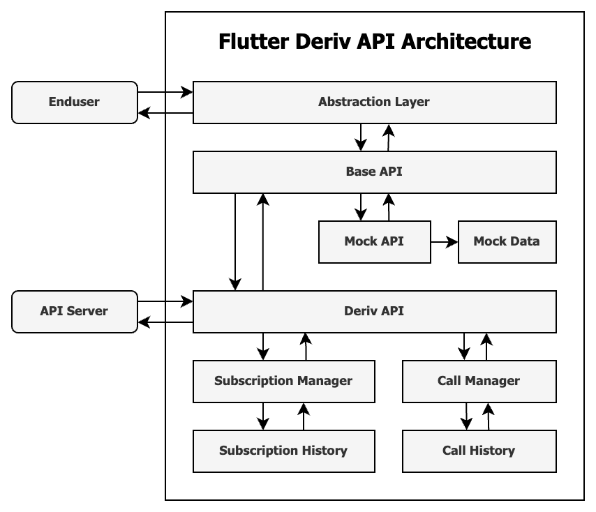

# Flutter Deriv API

Flutter Deriv API is an abstraction layer over `Binary WebSocket` (_https://github.com/binary-com/websockets_) for `Dart` and `Flutter` developers.

## Using Flutter Deriv API

### A. Creating a websocket connection

Use `APIInitializer` to prepare API instance for dependency injection, you can pass `true` to `isMock` parameter for testing purposes.

```dart
APIInitializer().initialize();
```

Establishing a connection to WebSocket needs an instance of the `ConnectionInformation` class for initializing API connection.

```dart
final BaseAPI api = Injector()<BaseAPI>();

api.connect(
    ConnectionInformation(
        appId: ...,
        brand: ...,
        endpoint: ...,
        language: ...,
    ),
    onDone: () async { ... },
    onOpen: () async { ... },
    printResponse: true,
);
```

### B. Calling API methods

You can invoke API calls with either using classes in the abstraction layer (`Ping, Order, Advert, ...`) or directly with API calls from the `BaseAPI` class.

#### Calling method by abstraction layer

```dart
final Ping ping = await Ping.ping();

print(ping.succeeded);
```

#### Calling method directly with `BaseAPI`

```dart
final BaseAPI api = Injector()<BaseAPI>();

final PingResponse response =
    await api.call(request: const PingRequest());

print(response.ping);
```

### Request Compare Predicate

To prevent adding duplicate requests `Subscription Manager` applies some mechanism to compare and return a suitable result if a subscription request already exists.

By default, the subscription manager uses the `Equatable` package to compare the current request with the request pool. Sometimes you do not want to rely on the package, in that case you can add `Compare Predicate` to your call API, and compare your request with already existing requests in subscription manager.

You just need to define a `Compare Predicate` method to compare your request.

```dart
...

subscribeToSomeApiCall(request, comparePredicate: getComparePredicate);

...

bool getComparePredicate({
    bool equatableResult,
    PendingRequest<Response> pendingRequest,
    Request request,
}) {
    SomeRequest otherRequest = pendingRequest.request as SomeRequest;
    SomeRequest currentRequest = request as SomeRequest;

    return equatableResult && otherRequest.param01 == currentRequest.param01 && ...;
}
```

---

## Documentation

### API Architecture

<br/>
<p align="center">
    
</p>

### API Reference

The complete API reference is [here](#).

---

## Development

### Clone repository

```
$ git clone https://github.com/regentmarkets/flutter-deriv-api.git

$ cd flutter-deriv-api
$ flutter pub get
```

### Setup
```bash
$ make update_schemas
$ make setup
$ dart run build_runner build --delete-conflicting-outputs
```


### Use this package as a library

Add this to your package's `pubspec.yaml` file:

```
dependencies:
    ...
    flutter_deriv_api:
        git:
            url: https://github.com/regentmarkets/flutter-deriv-api.git
            ref: master
```

### Run the tests

```
$ flutter test
```

### Generate documentations

```
$ dartdoc
```

---

## Tools

### JSON Schema Parser

`JsonSchemaParser` class is a tool for extracting main and nested classes from model schema contents.

#### Using schema parser

- Call `getModels(Map<String, dynamic> schema)` method and pass decoded schema to it.

- Pass the result of `getModels` method to `getClasses(List<SchemaModel> models, String className)` as `models` parameter.

The final result is a `string` that contains the main class and all related classes of that schema file including `Model Classes, Constructors, Properties` and `toJson(), fromJson(), copyWith()` Methods.

#### Run schema parser

```
$ flutter pub run lib/tools/parser.dart <json_schema_path> <main_class_name>
```

#### Example

```
$ flutter pub run lib/tools/parser.dart active_symbols_receive.json ActiveSymbols
```

#### Notes

1. This tool is for helping developers to convert JSON Schema easier, you may require some adjustments to the result file according to your needs.
2. The resulting file will be generated in the same path as the JSON schema file.
3. Some JSON schemas are not standard and this tool may not convert them properly.
